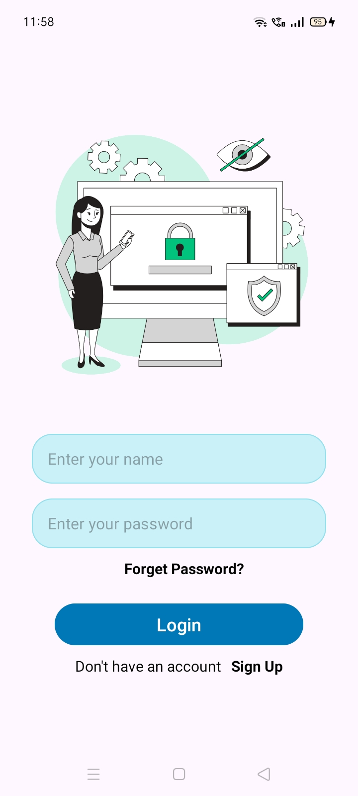
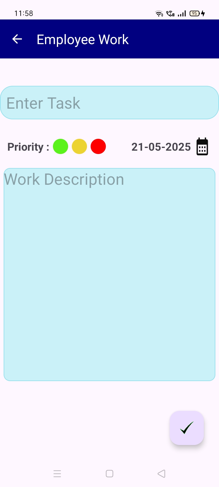
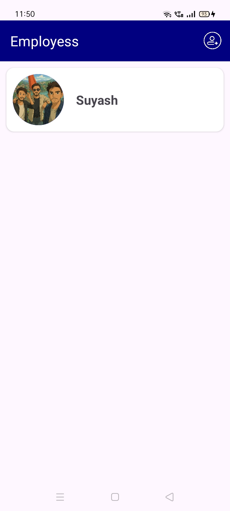

# 📱 WorkAssign – Task Management App for Teams 🚀

WorkAssign is a simple and efficient Android app that helps assign and track tasks between bosses and employees in real time using Firebase.

---

## 🔑 Features

- 👥 Dual User Roles: Boss & Employee
- 📝 Task assignment with:
  - Title, Description
  - Priority (High/Medium/Low)
  - Due Date
- ⏱️ Employees can:
  - Start/Complete tasks
  - View assigned tasks by status
- 🔔 Real-time Firebase Messaging for instant notifications
- 🔐 Firebase Authentication:
  - Login
  - Password Reset
  - Email Verification
- 📊 Tasks sorted by status (In Progress, Completed)
- 🔒 Role-based access & secure Firestore structure

---

## 🛠 Tech Stack

- Kotlin + Android XML
- Firebase Auth
- Firebase Firestore
- Firebase Cloud Messaging (FCM)
- Firebase Realtime Database (for some features if needed)
- MVVM Architecture
- Coroutines 

---

## 📸 Screenshots

| Login | Assign Task | Dashboard |
|-------|-------------|-----------|
|  |  |  |

## 🚀 Getting Started

1. **Clone the repo**
 
https://github.com/Suyash0202/Work-Assign.git
